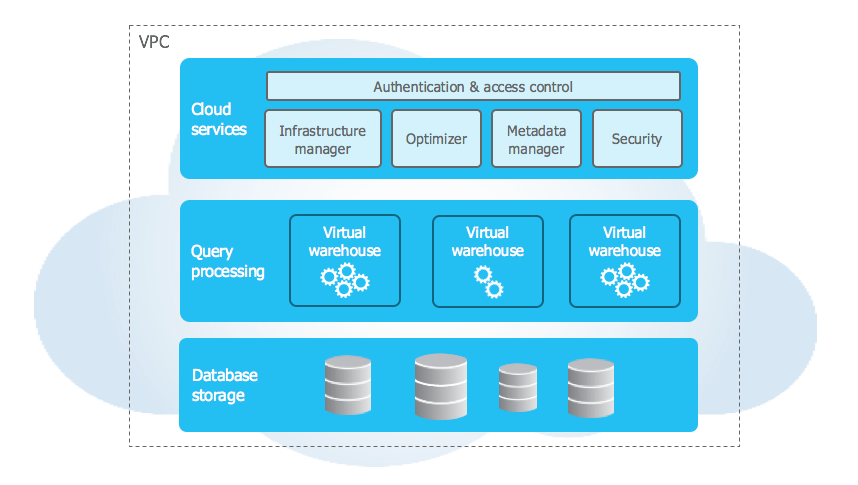

# Architecture #

Snowflake's architecture is a hybrid of traditional shared-disk and shared-nothing database architectures.
* Similar to shared-disk architectures:
  * Snowflake uses a central data repository for persisted data accessible from all compute nodes in the platform
  * Offers data management simplicity
* Similar to shared-nothing architectures
  * Snowflake processes queries using virtual warehouses where each node in the cluster stores a portion of the entire data set locally
  * Offers performance and scale-out benefits

## Snowflake Layers ##
Snowflake's unique architecture consists of three layers, all of them with High Availability. The price is also charged separately for each layer.

> In addition, there is the Cloud Agnostic Layer - allows Snowflake to run on the major cloud providers: AWS, Azure, GCP. It is used only the first time when we choose a provider.

* Centralized Storage: single copy and source of truth for the data. Data is stored in Snowflake's internal optimized, compressed, columnar format. Snowflake manages all aspects of how this data is stored.
* Multi-Cluster Compute (Virtual Warehouses): each Virtual Warehouse is a Massively Parallel Processing (MPP) compute cluster composed of multiple compute nodes allocated by Snowflake from a cloud provider.
* Cloud Services Layer: collection of services that coordinate activities across Snowflake. It includes:
  * Authentication
  * Infrastructure management
  * Metadata management
  * Query parsing and optimization
  * Access control

## Cloud Services Layer ##

* Manages all activity across Snowflake
  * Centralized storage
    * Micropartitions
    * Micropartition versioning for Time Travel
  * Compute
  * Metadata and Statistics collected and kept up-to-date
  * Handles queries that depend on Metadata only (no Warehouse required), e.g.:
    * Retrieve or modify the session context
    * Retrieve metadata about objects (users, warehouses, databases)
    * Get statistics, e.g.: `MIN` and `MAX` of a column, `COUNT`, number of `NULL`s
    * DDL retrieval
  * Time Travel and Cloning
  * Security
    * Authentication
    * Access Control
      * Roles and Users
      * Shares
    * Encryption Key Management
  * Transactions
  * SQL Optimization
    * Cost-based
    * Automatic `JOIN` order optimization (no hints required)
    * Automatic statistics gathering
    * Data Pruning based on the metadata and statistics
  * Availability
  * Transparent online updates and patches
* Runs on Snowflake-managed compute
